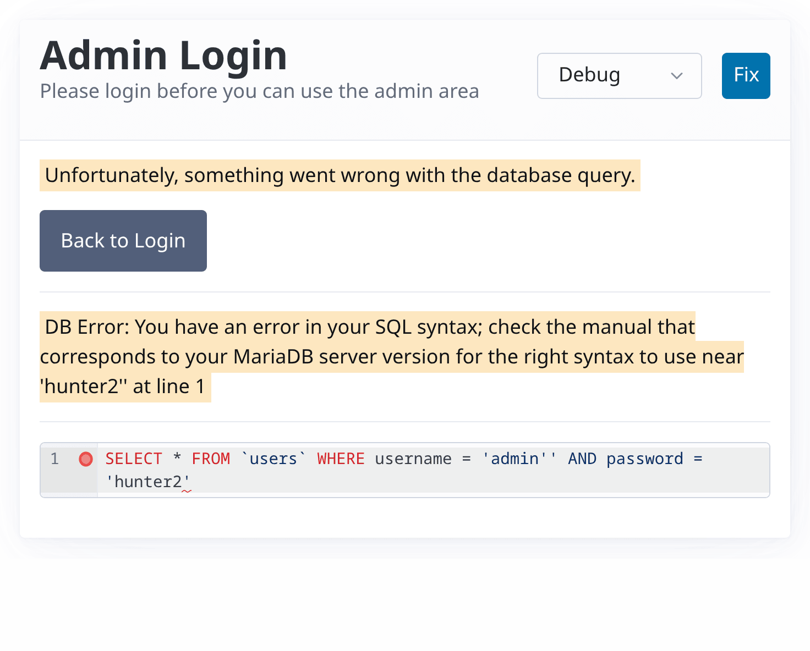
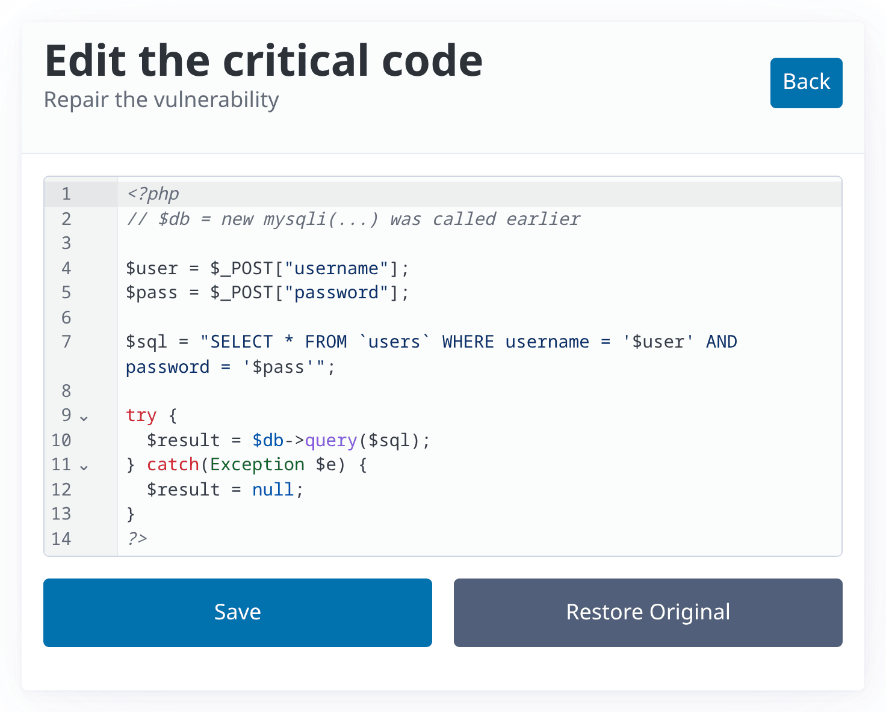

# glassbox-ctf

**Learn to hack by watching the exploit land, at the victim, and then patch the
hole live in your browser.**

[](https://github.com/hutzelmann/glassbox-ctf/actions/workflows/docker-publish.yml)
[](LICENSE)
[](#challenges)
[](https://github.com/hutzelmann?tab=packages&repo_name=glassbox-ctf)

<table>
<tr>
<td width="50%">
<a href="assets/glassbox-debug-light.png"><picture>
<source media="(prefers-color-scheme: dark)" srcset="assets/glassbox-debug-dark.png">

</picture></a>
<sub>See what your input did to the query, at the victim.</sub>
</td>
<td width="50%">
<a href="assets/glassbox-fix-light.png"><picture>
<source media="(prefers-color-scheme: dark)" srcset="assets/glassbox-fix-dark.png">

</picture></a>
<sub>Then patch the vulnerable line in the running target.</sub>
</td>
</tr>
</table>

Most security exercises are black boxes: you throw payloads at a target and guess
what happened inside. Every `glassbox-ctf` challenge is a small, deliberately
vulnerable app that lets you *watch its internals as you attack it*, then hands
you an in-browser editor to fix the one vulnerable line and prove your patch
works. Attack, understand, remediate, all in the same tab.

Built for classrooms and self-study: textbook vulnerabilities across web (SQL
injection, XSS) and binary exploitation (stack overflows, `ret2win`, `ret2libc`),
with fictional flags in throwaway containers that run completely offline.

## Quick start

You need a container runtime: [Podman Desktop](https://podman-desktop.io/) if you
would rather click, the [podman](https://podman.io/) CLI if you would rather
type, Docker either way. Both routes run the same image, and you can switch
between them at any point.

**Click:** in Podman Desktop go to **Containers**, **Create**, **Existing
image**, enter `ghcr.io/hutzelmann/glassbox-ctf-hello`, **Pull image and run**,
map local port **9000** to container port **80**, then **Start container**.

**Type:**

```bash
podman run --rm -p 9000:80 ghcr.io/hutzelmann/glassbox-ctf-hello
```

Either way, open <http://localhost:9000/>, find your first flag, then turn the
debug dial in the header up and click **Fix**, the two controls every challenge
shares. That is the whole workflow. Stop the container when you are done
(`Ctrl+C` in the terminal, the stop button in the desktop client): it leaves
nothing behind. New to containers? Run
[runtime-check](challenges/intro/runtime-check/) first, it only proves your setup
works.

## See the internals, then fix them

**A dial with three settings, not an on/off switch.** Every page carries a sticky
selector, so you buy exactly as much help as you need. Being stuck on a payload
is a different problem from not understanding the target.

1. **Challenge** (`?debug=0`) is the target exactly as a real one would hand it
   to you, no glass box at all.
2. **Hints** (`?debug=1`) adds tooling, and the symptom *your own* attempt
   provoked, never the answer: the database's own error message, a highlighting
   and linting editor on the field you attack through, a byte calculator, a live
   stack-frame table showing where your bytes landed.
3. **Debug** (`?debug=2`) adds what the target is doing inside, the internals a
   real attacker has to extract for themselves: the literal SQL your injection
   built and the rows it returned, the page the victim's browser rendered, the
   disassembly, the gadget addresses your payload jumps to, the `checksec` output.

Each level keeps everything the one below it gives you.

**Fix it live.** Each challenge isolates its single vulnerable snippet in a
`critical.<ext>` file (`critical.php` for web, `critical.c` for binary). The
built-in **Fix** editor saves your edit straight into the *running* target, so you
can retry your own exploit against your own patch, and **Restore Original** puts
the bug back. Compiled challenges rebuild on Save; a failed build shows you the
compiler errors while the last working binary keeps running. On the binary rungs
you can also edit the compiler flags and watch which exploit each protection
(stack canary, PIE, NX) kills.

## Challenges

Challenges come in families, one per class of target, and each family holds one
or more ladders. Climb a ladder in order: every rung builds on the one before.
Each folder holds a spoiler-free `README.md` (tasks and how to run) and a
`solution.md` with the full walkthrough, the flags and the fix, for when you are
stuck. Each image is `ghcr.io/hutzelmann/glassbox-ctf-<folder>`, run with the
command above.

### Intro

The on-ramp, no vulnerabilities yet.

- [runtime-check](challenges/intro/runtime-check/), proves your container runtime works
- [hello](challenges/intro/hello/), the first flag, plus the debug dial and the Fix editor

### Web

Vulnerable PHP apps with their own database or admin bot. Published for
`linux/amd64` and `linux/arm64`.

**SQL injection**

1. [sqli-login](challenges/web/sqli-login/), login bypass, `UNION` reads, dumping a database
2. [sqli-blind](challenges/web/sqli-blind/), extracting data with no visible output, boolean and time-based
3. [sqli-insert](challenges/web/sqli-insert/), injection in an `INSERT`: exfiltration and account forgery

**Cross-site scripting**

1. [xss-light](challenges/web/xss-light/), reflected XSS and reading a cookie
2. [xss-shop](challenges/web/xss-shop/), injecting HTML/JS and defeating client-side validation
3. [xss-cookie](challenges/web/xss-cookie/), the full chain: XSS to admin bot to cookie theft, offline

### Binary

Real x86-64 ELF binaries you overflow, recompile and re-attack in the browser.
Published for `linux/amd64`; they run under emulation on arm64 hosts.

**Stack overflow**

1. [ret2win](challenges/binary/ret2win/), overflow a stack buffer, overwrite the saved return address, redirect execution to `win()`
2. [ret2libc](challenges/binary/ret2libc/), chain gadgets to call `system("/bin/sh")` past a non-executable stack

More families are on the way.

## For teachers

- **Self-contained and offline.** Hand students an image name; they run it and get
  to work. No accounts, no shared server, no data to reset, each container is its
  own sealed world with fictional flags.
- **Solutions are in the repo.** Every `solution.md` carries the full walkthrough
  plus a **Professional tools** section that redoes the exploit with the
  industry-standard tool for its domain (`sqlmap`, browser DevTools and an
  intercepting proxy, `pwntools` with `gdb`/`checksec`/`objdump`/`ROPgadget`), so
  students graduate from manual understanding to the real toolchain.
- **Flags are for participation, not grading.** Every flag ships inside the image
  the student is running: `podman save` plus `strings`, or simply unpacking the
  layers, hands over every flag without exploiting anything, and the walkthroughs
  are in this public repo as well. Assess the explanation and the fix instead. For
  a capstone, have the class revisit solved challenges with an agentic LLM pentest
  (e.g. HexStrike AI) and compare what the tools find to what they did by hand.

## Contributing

[AGENTS.md](AGENTS.md) is the single source of truth: conventions, architecture,
the build pipeline, and how to build the base chain and a challenge from source.
In short, challenges live under `challenges/<domain>/<name>/`, share a base-image
chain under `platform/`, and CI discovers them automatically, so adding a
challenge is adding its folder. **Non-trivial changes are drafted in OpenSpec
first** (`openspec/`); AGENTS.md states the threshold.

## A note on intent

This is defensive security education: the vulnerabilities are classic textbook
bugs from the standard curriculum, the secrets are fictional, and the targets are
throwaway local containers. The entire design points at one goal, understanding a
weakness well enough to fix it.
